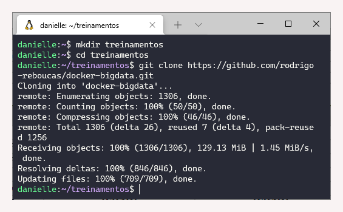
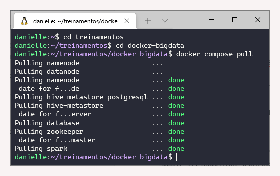
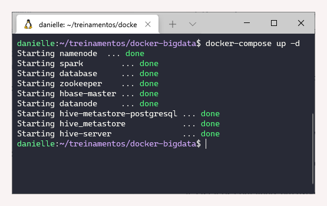
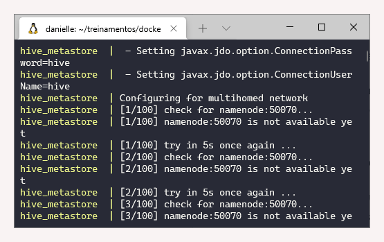
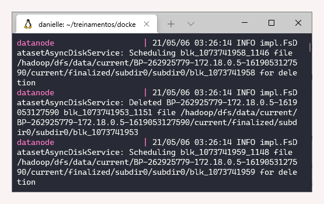
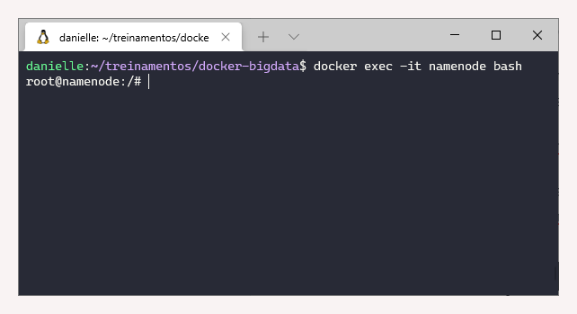
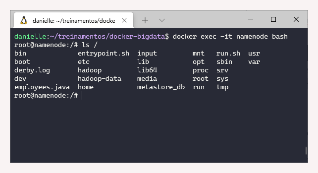
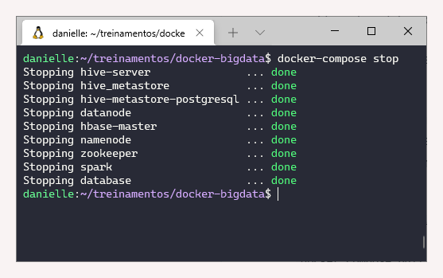

# 1.2 Hadoop

### Revisão do conteúdo 

Nessa aula foram mostrados as etapas de configuração do sistema operacional e programas necessários para realização deste primeiro módulo.

Para criação do _cluster_ Big Data podem ser utilizados como ambientes de desenvolvimento o Cloudera \(Horton Sandbox HDP ou Cloudera Quick Start VM\), o software da própria Semantix \(Open Galaxy\) ou _Containers_ \(Docker\), sendo este último o utilizado nesse curso.

Um passo a passo é apresentado a seguir:

### Etapas para instalação no Windows 10

1. Verificar o OS build \(Windows/System/Settings/About\). Caso seja inferior a 18362 precisa atualizar [Windows 10](https://www.microsoft.com/pt-br/software-download/windows10) \(20.04\) - Clicar em atualizar agora
2. Pesquisar por **Recursos** \(Ativar ou desativar recursos do Windows\)
   * Desativar Hyper-V
   * Desativar Plataforma do Hipervisor do Windows
   * Habilitar a Plataforma de Máquina Virtual
   * Habilitar o Subsistema do Windows para Linux \(WSL\)
3. Fazer download e instalar o [WSL 2](https://wslstorestorage.blob.core.windows.net/wslblob/wsl_update_x64.msi). 
4. Definir o WSL como padrão via Power Shell \(como administrador\) `wsl --set-default-version 2`
5. Fazer download e instalar uma distribuição Linux disponível na Microsoft Store, sendo recomendado o Ubuntu 20.04 LTS
6. Fazer download e instalar o [Docker Desktop](https://hub.docker.com/editions/community/docker-ce-desktop-windows/) - Clicar em Get Docker.
   * Abrir o programa e verificar se em _Settings - Resource - WSL Integration_ - estão habilitados o "Enable integration with my default WSL distro" e "Ubuntu-20.04"

### Exercício - Instalação

**1. Instalação do docker e docker-compose** 

* Etapa de instalação descrita acima

**2. Executar os seguintes comandos, para baixar as imagens do Cluster de Big Data:**

No terminal WSL, criei um diretório chamado _treinamentos_ com o comando`mkdir treinamentos` e em seguida foi realizado o acesso a ele com`cd treinamentos.`Dentro desse diretório, os seguintes comandos foram executados:

 `git clone https://github.com/rodrigo-reboucas/docker-bigdata.git  
cd docker-bigdata  
docker-compose pull`

**3. Iniciar o cluster Hadoop através do docker-compose**

* Para essa etapa, utilizar o comando `docker-compose up -d`

**4. Listar os containers em execução**

* Para listar os containers, utilizar o comando `docker ps,` no qual é possível verificar todos os containers que estão sendo executados e algumas de suas propriedades.

**5. Verificar os logs dos containers do docker-compose em execução**

* Para verificar logs, utilizar o comando `docker compose logs,` no qual é detalhado todos os logs do cluster \(hive, namenode, spark, zookeeper, ...\)  , 

**6. Verificar os logs do container namenode**

* Para essa etapa, utilizar o comando `docker logs namenode,` sendo detalhado todos os logs do namenode.  

**7.  Acessar o container namenode**

* Para acessar o namenode, utilizar o comando`docker exec -it namenode bash`  

 **8. Listar  os diretórios do container namenode**

* Para listar diretórios, estando dentro da máquina namenode usar o `ls /`Para sair do namenode, executar Control+D.
  * Outra forma é utilizar o comando `docker exec -it namenode ls /`  

**9. Parar os containers do Cluster de Big Data**

* Para finalizar os serviços, usar o comando`docker-composer stop.`  

