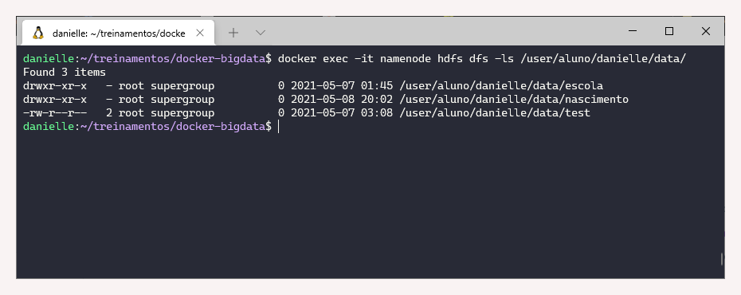
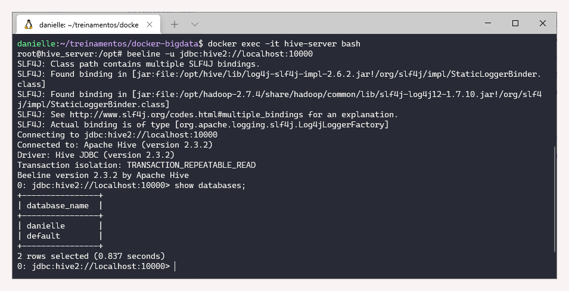
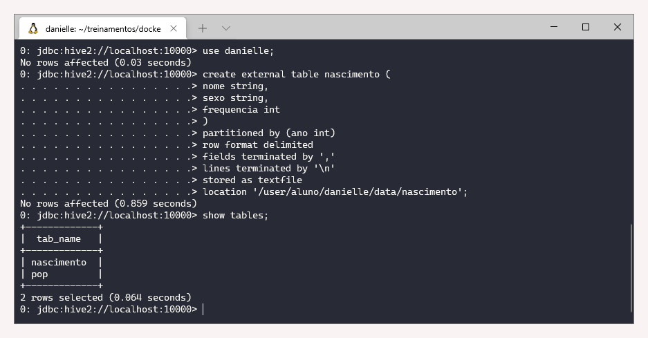
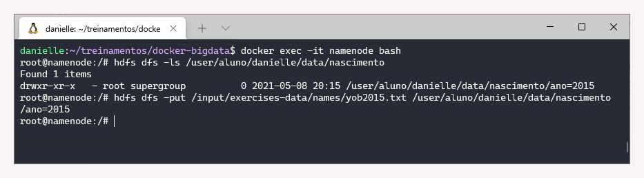
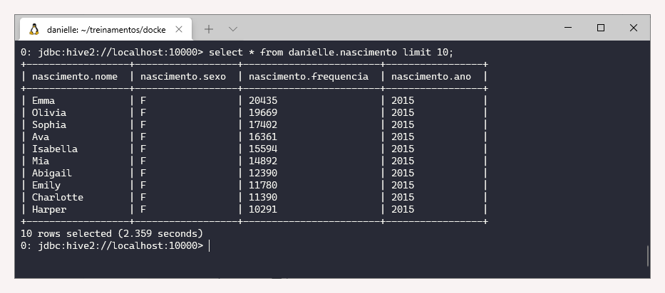
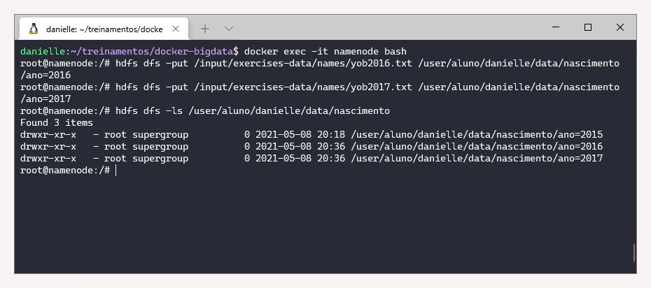
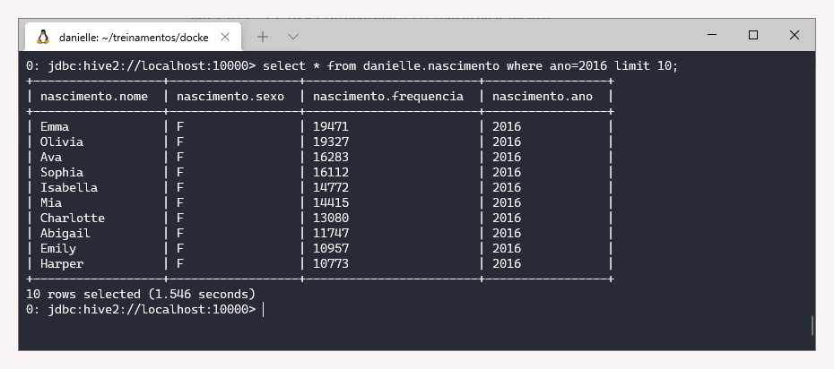
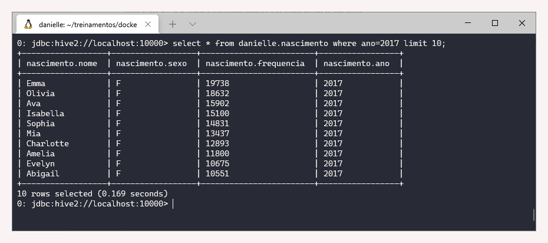

# 1.5 Hive

### Revisão do conteúdo

Essa aula é uma continuidade da anterior. Os itens abordados foram:  conceitos e tipos de particionamento e reparo de tabelas.


Comandos do HIVE estão disponibilizados na [documentação oficial](https://cwiki.apache.org/confluence/display/Hive/LanguageManual).


### Exercício - Criação de tabela particionada

Antes de iniciar os exercícios, é necessário ativar o cluster. Os comandos foram apresentados nas aulas anteriores:

`cd treinamentos   
cd docker-bigdata  
docker-compose up -d`

**1. Criar o diretório “/user/aluno/&lt;nome&gt;/data/nascimento” no HDFS**

Para realizar essa tarefa, pode-se utilizar uma única linha de comando:  

`docker exec -it namenode hdfs dfs -mkdir /user/aluno/danielle/data/nascimento`

Para verificar a criação, basta usar o`-ls`

`docker exec -it namenode hdfs dfs -ls /user/aluno/danielle/data/`

**2. Criar e usar o Banco de dados &lt;nome&gt;**

* Realizado anteriormente \(Aula 1.4\)

**3. Criar uma tabela externa no Hive com os parâmetros:**

_a\) Tabela: nascimento  
****b\) Campos: nome \(String\), sexo \(String\) e frequencia \(int\)  
c\) Partição: ano  
d\) Delimitadores: Campo ‘,’ e  Linha ‘\n’  
e\) Salvar: Tipo do arquivo: texto e HDFS '/user/aluno/&lt;nome&gt;/data/nascimento’_

Para acessar o Hive tem que primeiro sair do namenode \(Control+D\) e em seguida utilizar o seguinte comando: `docker exec -it hive-server bash.` 

Para acessar o beeline, pode-se utilizar o comando de ajuda \(`beeline --help`\) para saber quais as opções de conexão.

Utilizado a conexão de forma simples:`beeline -u jdbc:hive2://localhost:10000`

Em seguida verificar os bancos de dados com `show databases;`

Para criar a tabela externa, executar os seguintes comandos:

`use danielle;`  
`create external table nascimento (nome string, sexo string, frequencia int) partitioned by (ano int) row format delimited fields terminated by ',' lines terminated by '\n' stored as textfile location '/user/aluno/danielle/data/nascimento';`

**4.Adicionar partição ano=2015**

Para criar o diretório ano=2015, utiliza-se o comando: `alter table nascimento add partition(ano=2015);`

**5.Enviar o arquivo local “input/exercises-data/names/yob2015.txt” para o HDFS no diretório /user/aluno/&lt;nome&gt;/data/nascimento/ano=2015**

Para realizar essa tarefas, deve-se sair do Beeline e Hive \(Control+D\) e acessar o _namenode com_ `docker exec -it namenode bash`

Primeiro, vamos verificar a criação da partição ano=2015 `hdfs dfs -ls /user/aluno/danielle/data/nascimento`

O envio do arquivo é realizado por:

`hdfs dfs -put /input/exercises-data/names/yob2015.txt /user/aluno/danielle/data/nascimento/ano=2015`

**6.Selecionar os 10 primeiros registros da tabela nascimento no Hive**

Para visualizar os registros, novamente acessamos o _beeline_ e consultamos a tabela nascimento

`docker exec -it hive-server bash  
beeline -u jdbc:hive2://localhost:10000  
select * from danielle.nascimento limit 10;`

**7.Repita o processo do 4 ao 6 para os anos de 2016 e 2017.**

Semelhante às etapas acima, a seguinte sequência de comandos foi utilizada:

`use danielle;  
alter table nascimento add partition(ano=2016);  
alter table nascimento add partition(ano=2017);`

`hdfs dfs -put /input/exercises-data/names/yob2016.txt /user/aluno/danielle/data/nascimento/ano=2016`

`hdfs dfs -put /input/exercises-data/names/yob2017.txt /user/aluno/danielle/data/nascimento/ano=2017`

`hdfs dfs -ls /user/aluno/danielle/data/nascimento`

E, por fim, a verificação dos 10 primeiros dados

`select * from danielle.nascimento where ano=2016 limit 10;`

`select * from danielle.nascimento where ano=2017 limit 10;`

