# 1.6 Hive

### Revisão do conteúdo

Essa aula é uma continuidade da anterior. Inicialmente foram realizadas consultas nas tabelas criadas na [Aula 1.5](1.5-hive.md#exercicio-criacao-de-tabela-particionada). Na sequência, foram apresentados os formatos de armazenamento e compressão dos arquivos, com destaque de suas características e como realizar a criação de tabelas otimizadas. 


Comandos do HIVE estão disponibilizados na [documentação oficial](https://cwiki.apache.org/confluence/display/Hive/LanguageManual), e para referência e consultas, uma página que gosto muito sobre [SQL](https://www.1keydata.com/pt/sql/).


### Exercício - Seleção de tabelas HIVE

Antes de iniciar os exercícios, é necessário ativar o cluster e acessar o Hive:

`cd treinamentos   
cd docker-bigdata  
docker-compose up -d  
docker exec -it hive-server bash  
beeline -u jdbc:hive2://localhost:10000`

**1. Selecionar os 10 primeiros registros da tabela nascimento pelo ano de 2016**

* Essa etapa foi realizada anteriormente, no último exercício da Aula 1.5

**2. Contar a quantidade de nomes de crianças nascidas em 2017**

`select count(nome) as qtde from nascimento where ano=2017;`

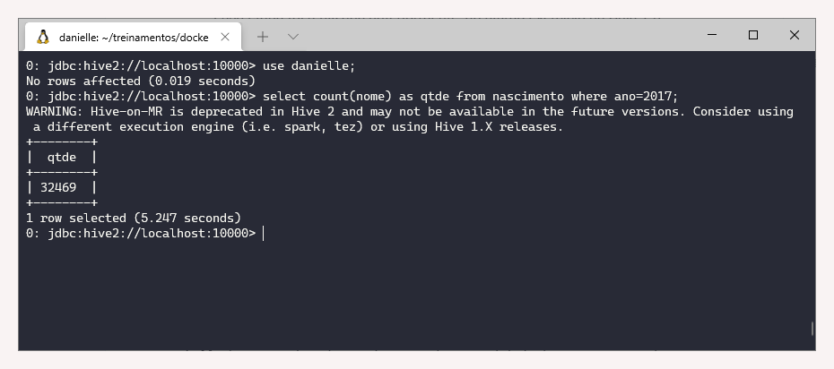

**3. Contar a quantidade de crianças nascidas em 2017**

`select sum(frequencia) as qtde from nascimento where ano=2017;`

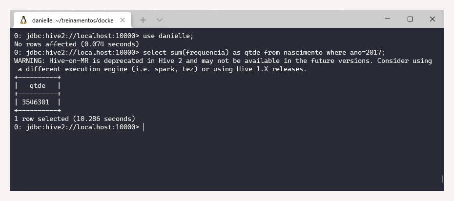

**4. Contar a quantidade de crianças nascidas por sexo no ano de 2015**

`select sexo, sum(frequencia) as qtde from nascimento where ano=2015 group by sexo;`

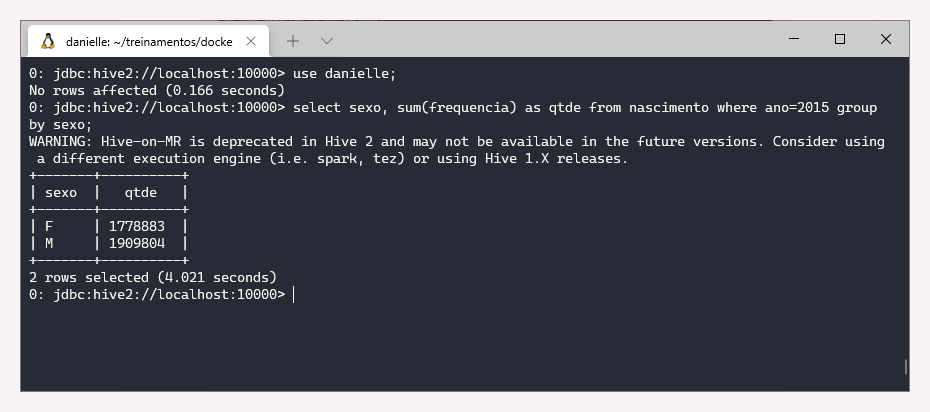

**5. Mostrar por ordem de ano decrescente a quantidade de crianças nascidas por sexo**

`select ano, sexo, sum(frequencia) as qtde from nascimento group by ano, sexo order by ano desc;`

**6. Mostrar por ordem de ano decrescente a quantidade de crianças nascidas por sexo com o nome iniciado com ‘A’**

`select ano, sexo, sum(frequencia) as qtde from nascimento where nome like 'A%' group by ano, sexo order by ano desc;`

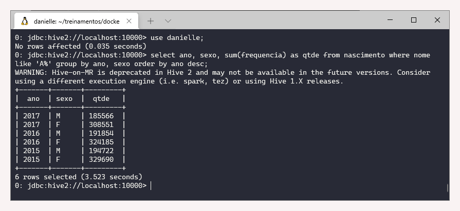

**7. Qual nome e quantidade das 5 crianças mais nascidas em 2016**

`select nome, sum(frequencia) as qtde from nascimento where ano=2016 group by nome order by qtde desc limit 5;`

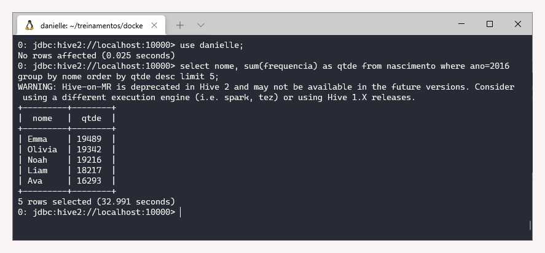

**8. Qual nome e quantidade das 5 crianças mais nascidas em 2016 por sexo** 

`select nome, sum(frequencia) as qtde, sexo from nascimento where ano=2016 group by nome, sexo order by qtde desc limit 10;`

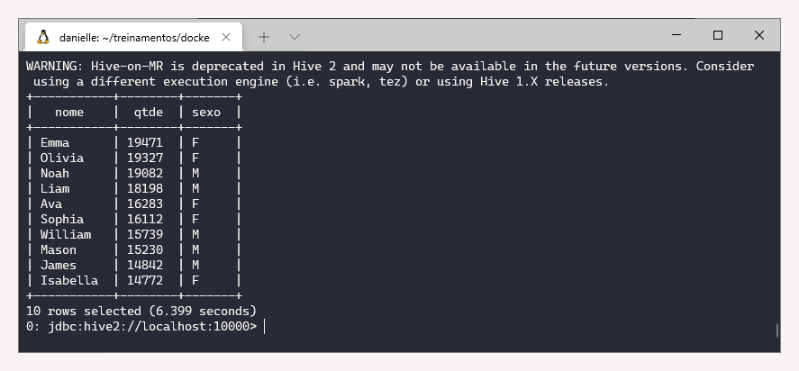

### Exercício - Criação de tabelas otimizadas

Antes de iniciar os exercícios, é necessário ativar o cluster e acessar o Hive.

`cd treinamentos   
cd docker-bigdata  
docker-compose up -d  
docker exec -it hive-server bash  
beeline -u jdbc:hive2://localhost:10000`

**1. Usar o banco de dados &lt;nome&gt;**

`show database;   
use danielle;`

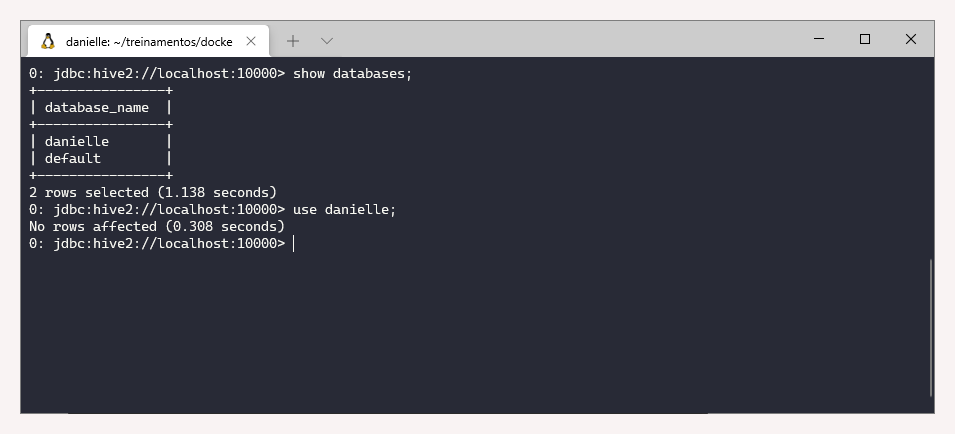

**2. Selecionar os 10 primeiros registros da tabela pop**

`select * from pop limit 10;`

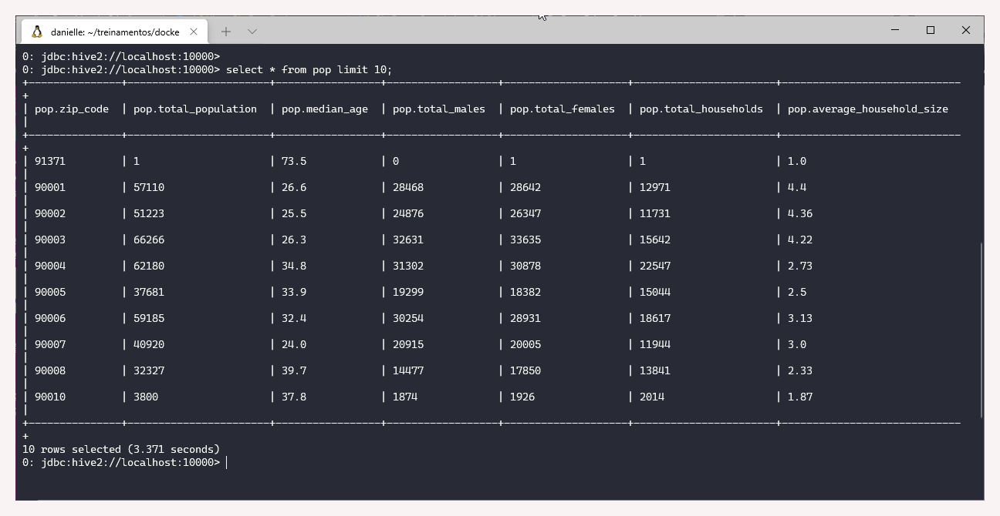

**3. Criar a tabela pop\_parquet no formato parquet para ler os dados da tabela pop**

As instruções do nome e tipo das colunas são iguais ao exercício da [Aula 1.4](1.4-hive.md).

`use danielle;  
create table pop_parquet (zip_code int, total_population int, median_age float, total_males int, total_females int, total_households int, average_household_size float) stored as parquet;`

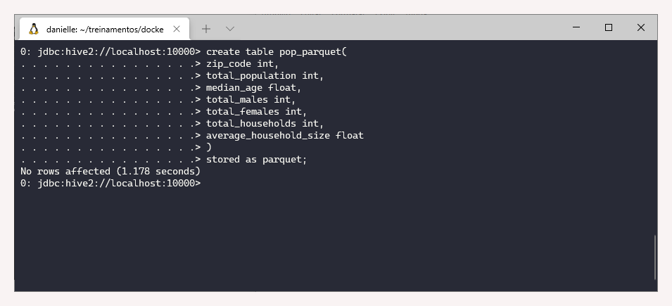

**4. Inserir os dados da tabela pop na pop\_parquet**

Nota: A tabela pop foi criada anterioremente.

`insert into pop_parquet select * from pop;`

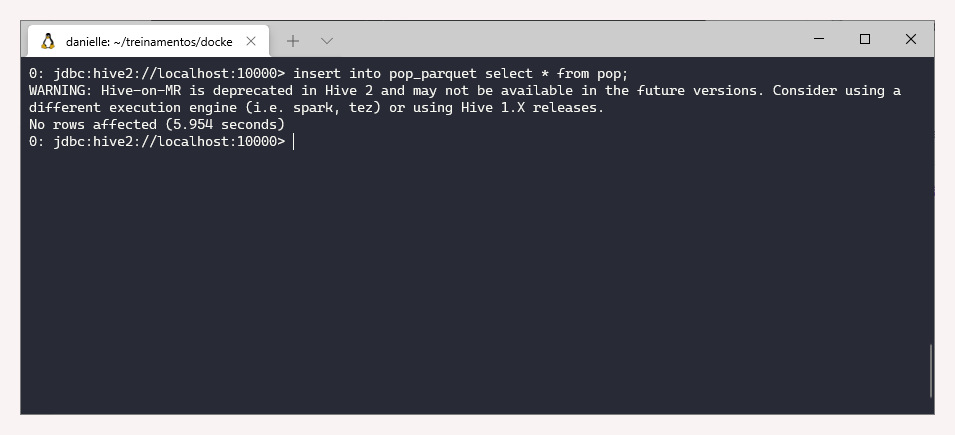

**5. Contar os registros da tabela pop\_parquet**

`select count(*) from pop;  
select count (*) from pop_parquet;`

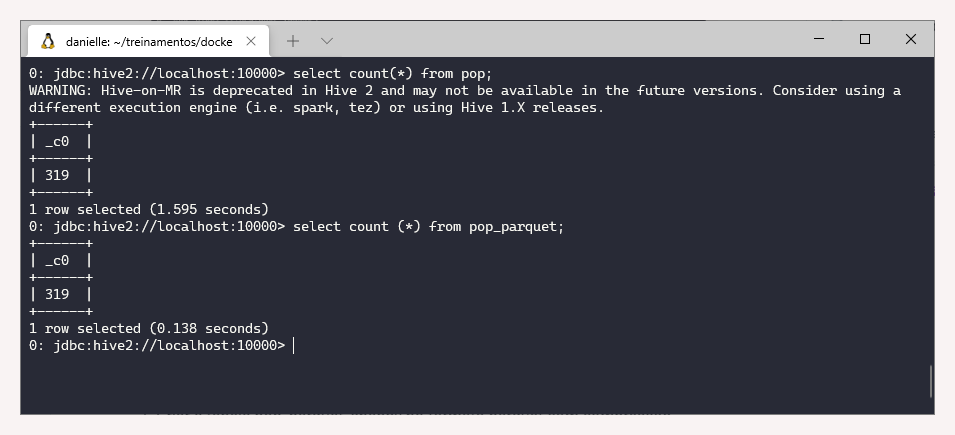

6. Selecionar os 10 primeiros registros da tabela pop\_parquet

`select * from pop_parquet limit 10;`

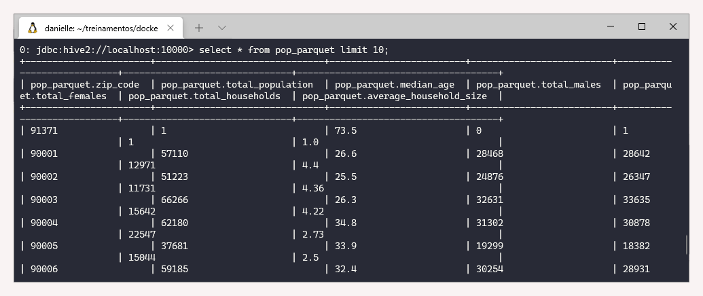

**7. Criar a tabela pop\_parquet\_snappy no formato parquet com compressão Snappy para ler os dados da tabela pop**

A resolução das questões 7 a 10 é similar ao apresentado acima, portanto serão apresentados somente os códigos, sem as imagens do terminal.

`use danielle;  
create table pop_parquet_snappy (zip_code int, total_population int, median_age float, total_males int, total_females int, total_households int, average_household_size float) stored as parquet tblproperties('parquet.compress'='SNAPPY');`

**8. Inserir os dados da tabela pop na pop\_parquet\_snappy**

`insert into pop_parquet_snappy select * from pop;`

**9. Contar os registros da tabela pop\_parquet\_snappy**

`select count (*) from pop_parquet_snappy;`

**10. Selecionar os 10 primeiros registros da tabela pop\_parquet\_snappy**

`select * from pop_parquet_snappy limit 10;`

**11. Comparar as tabelas pop, pop\_parquet e pop\_parquet\_snappy no HDFS.**

Primeiro vamos verificar as tabelas existente no banco de dados. Para isso, utiliza-se o comando `hdfs dfs -ls /user/hive/warehouse/danielle.db`

Uma forma de comparar as tabelas é avaliar o armazenamento, por:  
`hdfs dfs -du -h /user/hive/warehouse/danielle.db`

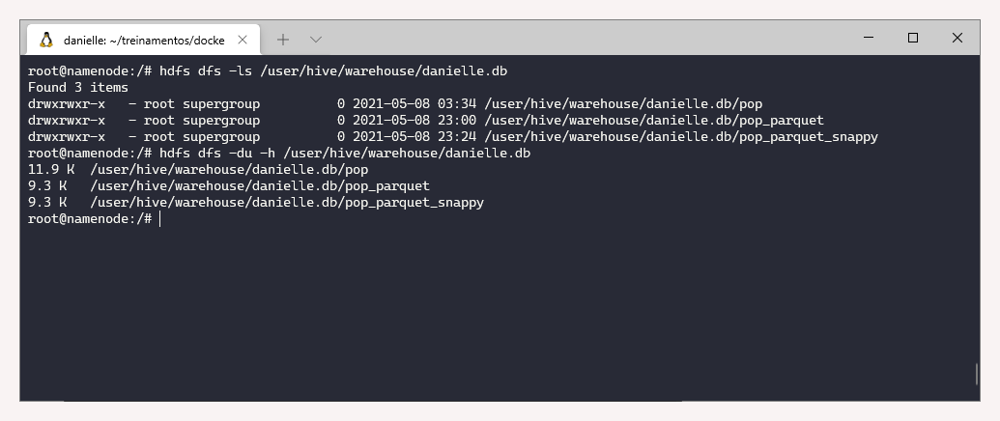

