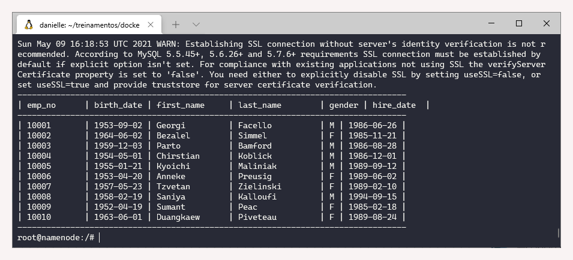
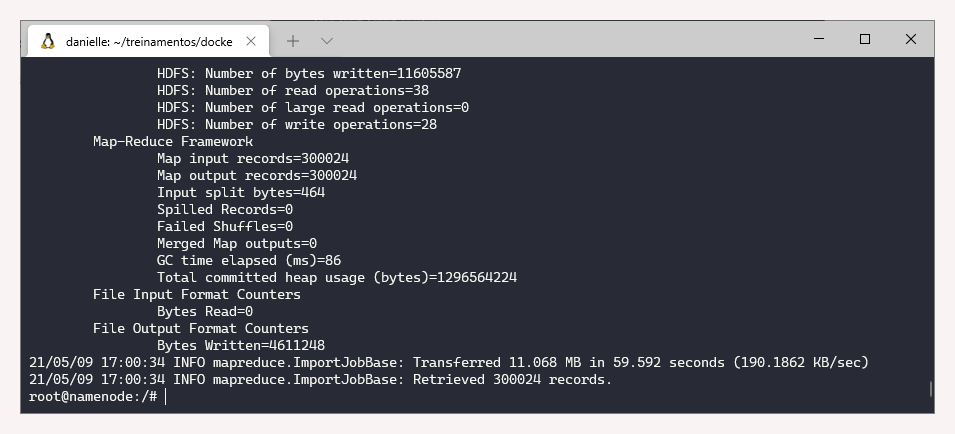
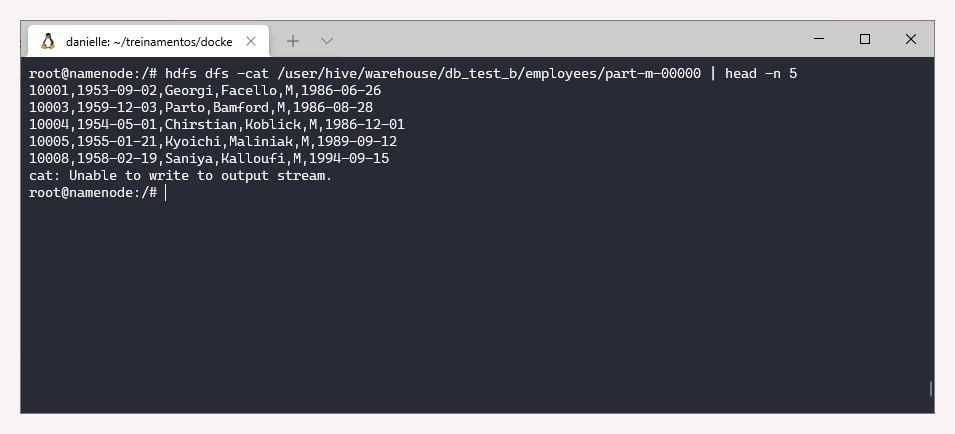
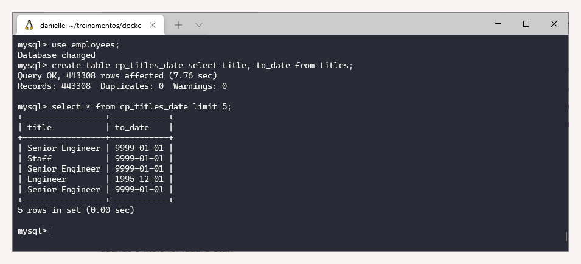
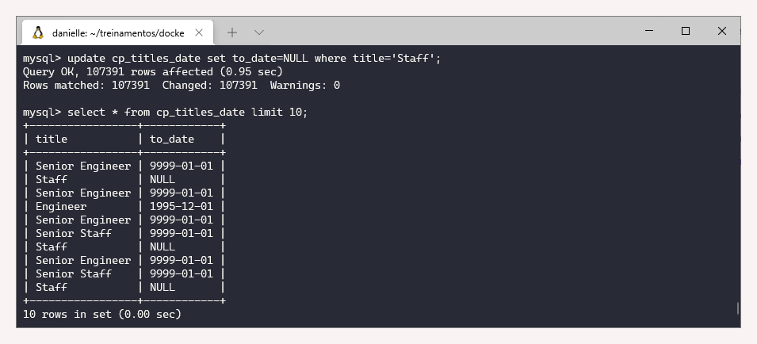
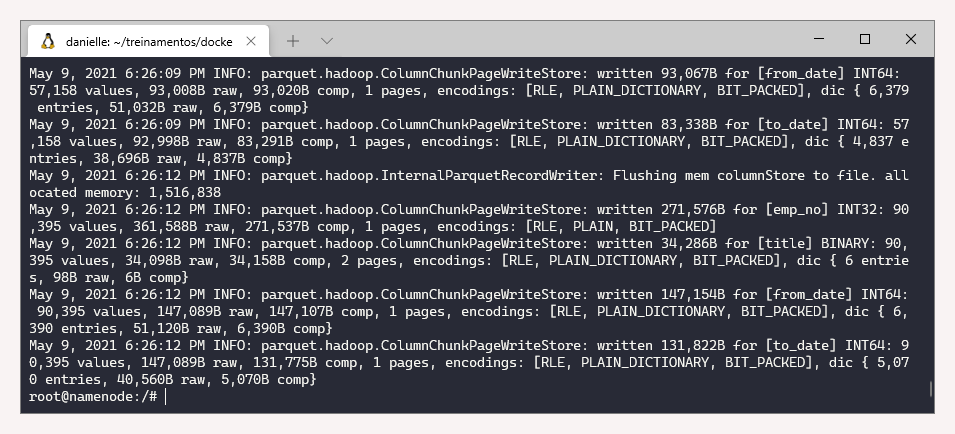
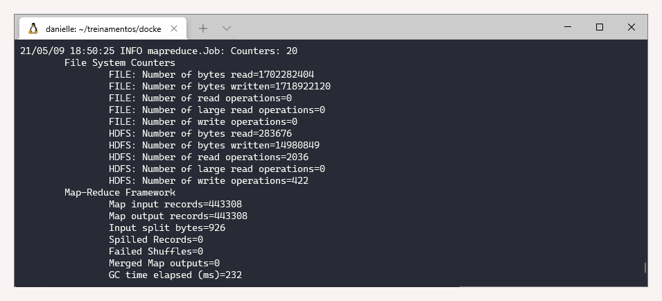
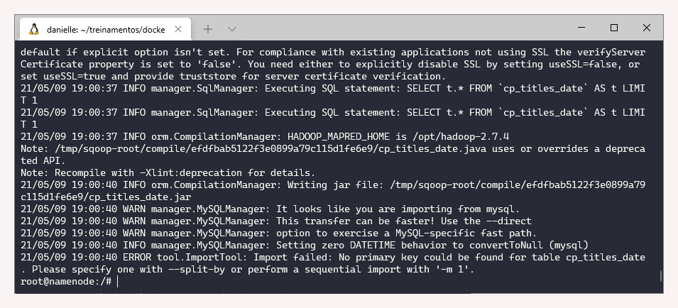

# 1.8 Sqoop

### Revisão do conteúdo

Essa aula é uma continuidade da anterior \([Aula 1.7](1.7-sqoop.md)\). Foram apresentadas mais informações sobre importação de dados, como armazenamento em diretórios diferentes e delimitadores. Também foram detalhados formas de otimizar a importação dos dados \(paralelismo do _job_\), tratamento dos dados nulos, formato e compressão de dados.


Um guia de usuário está disponibilizado na [documentação oficial](https://sqoop.apache.org/docs/1.4.7/SqoopUserGuide.html).


### Exercício - Importação BD Employees

Antes de iniciar os exercícios, é necessário ativar o cluster:

`cd treinamentos   
cd docker-bigdata  
docker-compose up -d`

**1. Pesquisar os 10 primeiros registros da tabela employees do banco de dados employees.**

Para realizar a consulta da tabela, utilizamos o seguinte comando:

`docker exec -it namenode bash  
sqoop eval --connect jdbc:mysql://database/employees  --username root --password secret --query "select * from employees limit 10"`

**2. Realizar as importações referentes a tabela employees e para validar cada questão,  é necessário visualizar no HDFS** \(_veja a dica no final da questão_\)

* Importar a tabela employees, no warehouse  /user/hive/warehouse/db\_test\_a

`sqoop import --table employees --connect jdbc:mysql://database/employees --username root --password secret --warehouse-dir /user/hive/warehouse/db_test_a`

Na imagem apenas a parte final do código de saída, na qual é possível obter dados como: quanto foi mapeada na entrada, e na saída, se teve falha, o tempo necessário, entre outras. Essa informação significa que o mapreduce funcionou, que o processo foi executado sem erro.

* Importar todos os funcionários do gênero masculino, no warehouse  /user/hive/warehouse/db\_test\_b

Na tabela mostrada no item 1, vemos que o nome da colunas que contém a informação  de gênero é a _gender._

`sqoop import --table employees --connect jdbc:mysql://database/employees --username root --password secret --where "gender='M'" --warehouse-dir /user/hive/warehouse/db_test_b`

* Importar o primeiro e o último nome dos funcionários com os campos separados por tabulação, no warehouse  /user/hive/warehouse/db\_test\_c

Na tabela mostrada no item 1, vemos que o nome das colunas são: _first\_name e last\_name._

`sqoop import --table employees --connect jdbc:mysql://database/employees --username root --password secret --columns "first_name, last_name" --fields-terminated-by '\t' --warehouse-dir /user/hive/warehouse/db_test_c`

* Importar o primeiro e o último nome dos funcionários com as linhas separadas por “ : ” e salvar no mesmo diretório da questão 2.C

Como o local para salvar é um diretório que já existe, criado na questão anterior, é necessário deletar o que já existe.

`sqoop import --table employees --connect jdbc:mysql://database/employees --username root --password secret --columns "first_name, last_name" --lines-terminated-by ':' --warehouse-dir /user/hive/warehouse/db_test_c -delete-target-dir`

_Dica para visualizar no HDFS_:   
`hdfs dfs -cat /user/hive/warehouse/db_test_c/employees/part-m-00000 | head -n 5`

`Exemplo:`

### Exercício - Importação BD Employees - Otimização

_a\) Realizar com uso do MySQL_

Para acessar o mysql:  
`docker exec -it databases bash  
mysql -psecret`

  
**1. Criar a tabela cp\_titles\_date, contendo a cópia da tabela titles com os campos title e to\_date**

Para criar a tabela cp\_titles\_date e na sequência visualizar os dados, utilizar os seguintes comandos:

`use employees;  
create table cp_titles_date select title, to_date from titles;  
select * from cp_titles_date limit 5;`

**2. Pesquisar os 15 primeiros registros da tabela cp\_titles\_date**

* Semelhante à questão anterior, só altera a quantidade de registros visualizados. `select * from cp_titles_date limit 15;`

**3. Alterar os registros do campo to\_date para null da tabela cp\_titles\_date, quando o título for igual a Staff**

Para alteração e visualização, utiliza-se os seguintes comandos:

`update cp_titles_date set to_date=NULL where title='Staff';  
select * from cp_titles_date limit 10;`

_b\) Realizar com uso do Sqoop - Importações no warehouse_ /user/hive/warehouse/db\_test\_&lt;numero\_questao&gt; e visualizar no HDFS

Para acessar o _namenode_:  
__`docker exec -it namenode bash`

**4. Importar a tabela titles com 8 mapeadores no formato parquet**

Para realizar o import, nas condições definidas no enunciado:

`sqoop import --table titles --connect jdbc:mysql://database/employees --username root --password secret -m 8 --as-parquetfile --warehouse-dir /user/hive/warehouse/db_test_4`

Na próxima imagem está representada apenas a parte final do código de saída.

**5. Importar a tabela titles com 8 mapeadores no formato parquet e compressão snappy**

Para realizar o import, nas condições definidas no enunciado:

`sqoop import --table titles --connect jdbc:mysql://database/employees --username root --password secret -m 8 --as-parquetfile --warehouse-dir /user/hive/warehouse/db_test_5 --compress --compression-codec org.apache.hadoop.io.compress.SnappyCodec` 

Visualização de apenas uma parte do código de saída:

Para visualizar as tabelas no HDFS, utiliza-se os seguintes comandos:  
`hdfs dfs -ls -h /user/hive/warehouse/db_test_4/titles  
hdfs dfs -ls -h /user/hive/warehouse/db_test_5/titles`

**6. Importar a tabela cp\_titles\_date com 4 mapeadores \(erro\)**

Para realizar o import:

`sqoop import --table cp_titles_date --connect jdbc:mysql://database/employees --username root --password secret --warehouse-dir /user/hive/warehouse/db_test6`

Conforme mensagem de erro, é necessário definir algum campo primário ou trocar o mapeamento por -1.

* Importar a tabela cp\_titles\_date com 4 mapeadores divididos pelo campo título no warehouse **/user/hive/warehouse/db\_test\_title**

Nota: 4 mapeadores é o valor padrão, por isso não foi incluído no comando abaixo:

`sqoop import -Dorg.apache.sqoop.splitter.allow_text_splitter=true --table cp_titles_date --connect jdbc:mysql://database/employees --username root --password secret --warehouse-dir /user/hive/warehouse/db_test6a_title --split-by title`

Final da mensagem de saída:

* Importar a tabela cp\_titles\_date com 4 mapeadores divididos pelo campo data no warehouse **/user/hive/warehouse/db\_test6b\_date**

Nota: 4 mapeadores é o valor padrão, por isso não foi incluído no comando abaixo:

`sqoop import -Dorg.apache.sqoop.splitter.allow_text_splitter=true --table cp_titles_date --connect jdbc:mysql://database/employees --username root --password secret --warehouse-dir /user/hive/warehouse/db_test6b_date --split-by to_date`

* Qual a diferença dos registros nulos entre as duas importações?

Para visualizar a diferença entre as duas importações, pode-se por exemplo, fazer um _count_ de cada local ou ainda listar os arquivos criados.

`hdfs dfs -count -h /user/hive/warehouse/db_test6a_title   
hdfs dfs -count -h /user/hive/warehouse/db_test6b_date  
dfs -count -h /user/hive/warehouse/db_test6a_title  
hdfs dfs -ls -h -R /user/hive/warehouse/db_test6b_date`

Quando realizado a divisão por quanto por _date_, os campos no qual o título era _Staff_ foram ignoradas, pois as datas eram nulas \(Exercício 3\).

