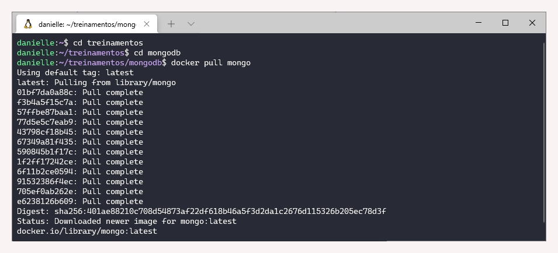
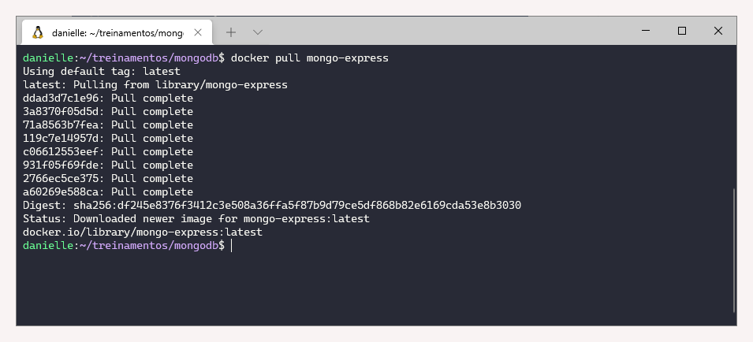
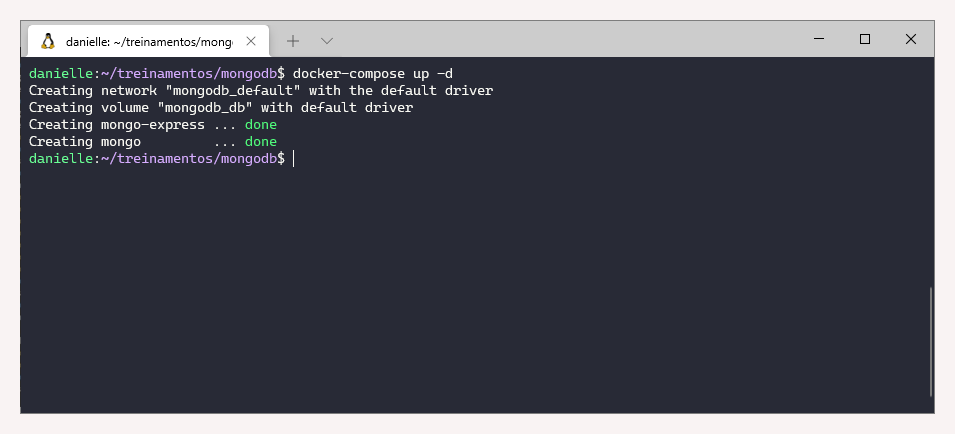
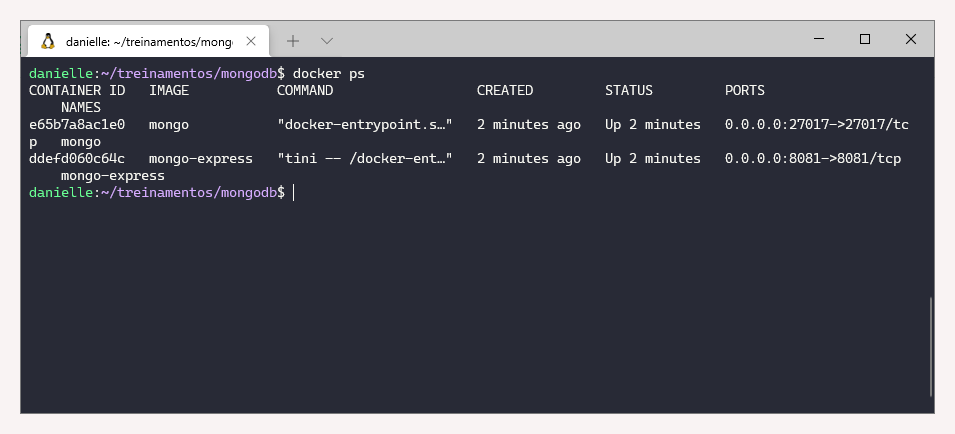
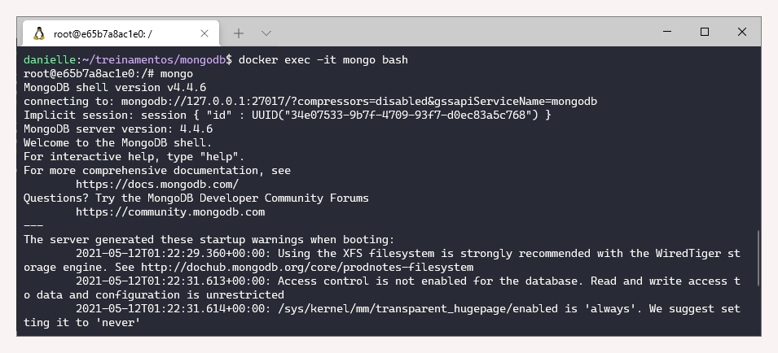
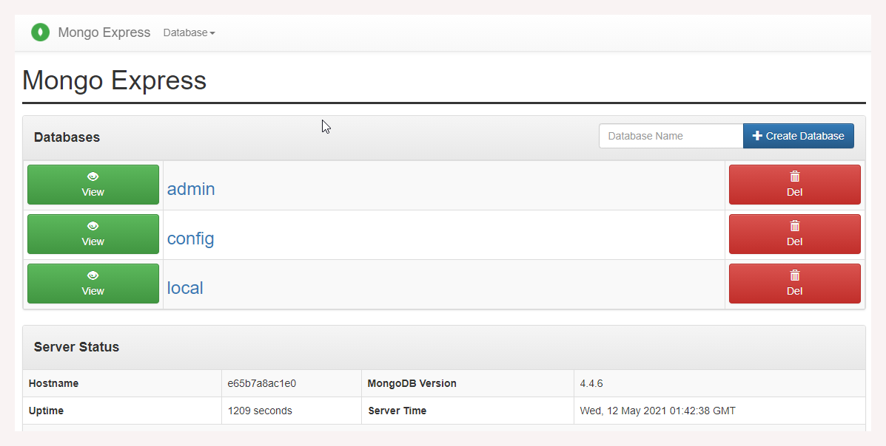

# 2.1 Introdução

### Revisão do conteúdo

Introdução sobre bancos de dados não relacionais \(NoSQL\), foram apresentadas suas principais características, a diferença entre conceitos \(ACID x BASE\) e o teorema CAP. Posteriormente foi realizada uma apresentação sobre MongoDB e como realizar a instalação em docker.


 Mais informações estão disponibilizadas na [documentação oficial.](https://docs.mongodb.com/)


### Exercício - Instalação

**1. Instalação do docker e docker-compose**

* Já realizado no módulo anterior \([1.2 Hadoop](../1-big-data-foundations/1.2-hadoop.md)\)

**2. Baixar as imagens do mongo e mongo-express**

Dentro do diretório mongodb foi inserido um arquivo yml \(docker-compose.yml\) com o seguinte código:

```text
version: '3.1'

services:

  mongo:
    image: mongo
    container_name: mongo
    restart: always
    ports:
      - 27017:27017
    volumes:
      - db:/data/db

  mongo-express:
    image: mongo-express
    container_name: mongo-express
    restart: always
    ports:
      - 8081:8081

volumes:
  db:   
```

Em seguida foram utilizados os comandos:

`docker pull mongo  
docker pull mongo-express`





**3.Iniciar o MongoDB através do docker-compose**

Para realizar essa etapa, utilizar o seguinte comando:

`docker-compose up -d`



**4. Listas as imagens em execução**

Para visualizar as imagens ativas, utiliza o `docker ps`



**5. Listar os bancos de dados do MongoDB**

Para listar os bancos de dados, é preciso acessar a instância do MongoDB.Para tal, utiliza-se os comandos na sequência:

`docker exec -it mongo bash  
mongo  
show dbs`



```text
> show dbs
admin   0.000GB
config  0.000GB
local   0.000GB
>
```

**6. Visualizar através do Mongo Express os bancos de dados**

No navegador, acessar: [http://localhost:8081/](http://localhost:8081/)



* Lembrando que para sair do contêiner, utiliza Control+D. E, ao finalizar o uso, parar o serviço com `docker compose stop.`

