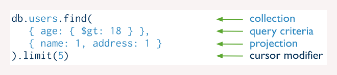

# 2.2 MongoDB

### Revisão do conteúdo

Apresentação dos principais comandos para criação de banco de dados, _collections_ e documentos, bem como a realização de consultas no BD.


Mais informações estão disponibilizadas na [documentação oficial](https://docs.mongodb.com) e de forma mais objetiva na seção de [CRUD](https://docs.mongodb.com/manual/crud/).


### Exercício - **Comando básicos para BD, Collections e Documentos**

Antes de iniciar os exercícios, é necessário ativar o cluster e acessar o Mongodb

`cd treinamentos`\
`cd mongodb`\
`docker-compose up -d`\
`docker exec -it mongo bash`\
`mongo`

**1. Criar o banco de dados com seu nome**

A criação do banco de dados é realizar por use\<nomeDB>

`use danielle`

**2. Listar os banco de dados**

Para listar os bancos, usar o comando db.

_Nota:_ O `show dbs`ainda não mostra o banco criado pois apenas após inserir uma _collection_ (tabela)  ele aparecerá na listagem.

**3. Criar a **_**collection**_** produto no bd com seu nome.**

Para criar uma tabela (_collection_), utiliza-se os seguintes comandos:

`use danielle`\
`db.createCollection('produto')`

A mensagem `"ok" : 1`  equivale ao True, isto é, uma confirmação de que a tabela foi criada.

**4. Listar os banco de dados.**

Como comentado no item 2: **** `show dbs`

**5. Listar as collections.**

Para exibir as tabelas criadas: `show collections`

Imagem de referência para as três questões acima:

**6. Inserir os seguintes documentos na **_**collection**_** produto:**

* \_id: 1, "nome": "cpu i5", "qtd": "15"&#x20;
* \_id: 2, nome: "memória ram", qtd: 10, descricao: {armazenamento: "8GB", tipo:"DDR4"}&#x20;
* \_id: 3, nome: "mouse", qtd: 50, descricao: {conexao: "USB", so: \["Windows", "Mac", "Linux"]}&#x20;
* \_id: 4, nome: "hd externo", "qtd": 20, descricao: {conexao: "USB", armazenamento: "500GB", so: \["Windows 10", "Windows 8", "Windows 7"]}

A inclusão de dados no _collection_, considerando os dados acima pode ser realizada da seguinte forma: &#x20;

`db.produto.insertOne({_id: 1, "nome": "cpu i5", "qtd": "15"})`

`db.produto.insertOne({_id: 2, nome: "memória ram", qtd: 10, descricao: {armazenamento: "8GB", tipo:"DDR4"}})`

`db.produto.insertOne({_id: 3, nome: "mouse", qtd: 50, descricao: {conexao: "USB", so: ["Windows", "Mac", "Linux"]}})`

`db.produto.insertOne({_id: 4, nome: "hd externo", "qtd": 20, descricao: {conexao: "USB", armazenamento: "500GB", so: ["Windows 10", "Windows 8", "Windows 7"]}})`

**7. Mostrar todos os documentos.**

A visualização dos documentos é realizada com o seguinte comando:\
`db.produto.find()`

ou `db.produto.find().pretty()`

### Exercício - **Consulta básica em documentos**

**1. Mostrar todos os documentos da **_**collection**_** produto**

* Essa atividade foi realizada anteriormente, no item 7 do exercício acima.

**2. Pesquisar na **_**collection**_** produto, os documentos com os seguintes atributos:**

a) Nome = mouse\
b) Quantidade = 20 e apresentar apenas o campo nome\
c) Quantidade <= 20 e apresentar apenas os campos nome e qtd\
d) Quantidade entre 10 e 20\
e) Conexão = USB e não apresentar o campo \_id e qtd\
f) SO que contenha “Windows” ou “Windows 10”

Para a realização de consultas, o comando segue a seguinte estrutura:

Para realizar as atividades de consulta propostas, os seguintes comandos foram utilizados:

a) `db.produto.find({nome : "mouse"})`

b) `db.produto.find({qtd : 20}}, {_id : 0, nome : 1})`

c) `db.produto.find({qtd : {$lte : 20}}, {_id:0, qtd: 1, nome : 1})`

d) `db.produto.find({qtd : {$gte : 10, $lte : 20}})`

e) `db.produto.find({"descricao.conexao" : "USB"}, {_id : 0, qtd : 0})`

f) `db.produto.find({"descricao.so" : {$in : ["Windows 10", "Windows"]}})`

__

_Exemplo de três consultas realizadas (letras D a F)_

### **Exercício - Outras opções com consultas**

**1. Mostrar todos os documentos da **_**collection**_** produto**

* Essa atividade foi realizada anteriormente, no item 7 do primeiro exercício.

**2. Realizar as seguintes pesquisas na **_**collection**_** produto:**

a) Mostrar os documentos ordenados pelo nome em ordem alfabética.\
b) Mostrar os 3 primeiros documentos ordenados por nome e quantidade.\
c) Mostrar apenas 1 documento que tenha o atributo Conexão = USB.\
d) Mostrar os documentos que tenham o atributo conexão = USB e quantidade menor que 25.\
e) Mostrar os documentos que tenham o atributo conexão = USB ou quantidade menor que 25.\
f) Mostrar apenas os id dos documentos de tenham o atributo conexão = USB ou quantidade menor que 25.

Para realizar as atividades de consulta propostas, os seguintes comandos foram utilizados:

a) `db.produto.find({}).sort({nome : 1})`

b) `db.produto.find({}).sort({nome : 1, qtd : 1}).limit(3)`

c) `db.produto.findOne({"descricao.conexao" : "USB"})`

d) `db.produto.find({"descricao.conexao" : "USB", qtd : {$lt : 25}})`

e) `db.produto.find({$or: [{"descricao.conexao" : "USB"}, {qtd : {$lt : 25}}]})`

f) `db.produto.find({$or: [{"descricao.conexao" : "USB"}, {qtd : {$lt : 25}}]},{_id : 1})`

__

_Exemplo de três consultas realizadas (letras D a F)_

