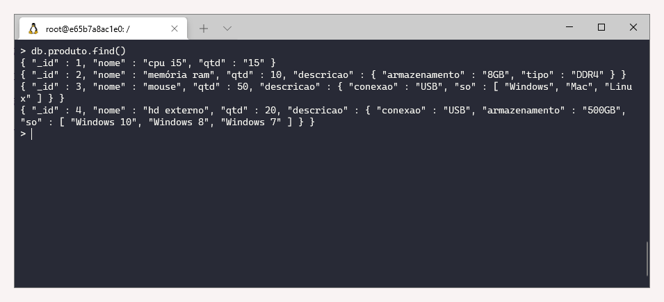
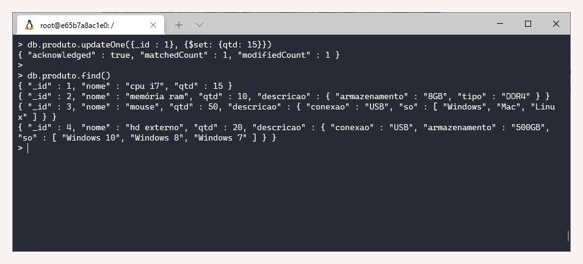
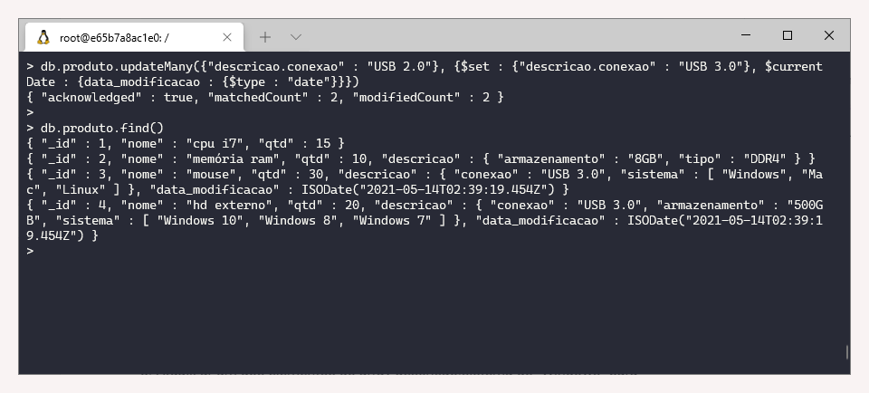
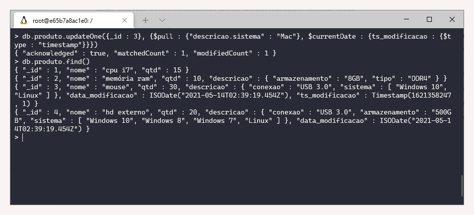
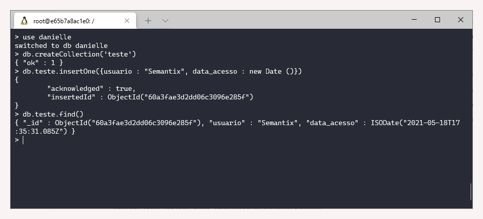
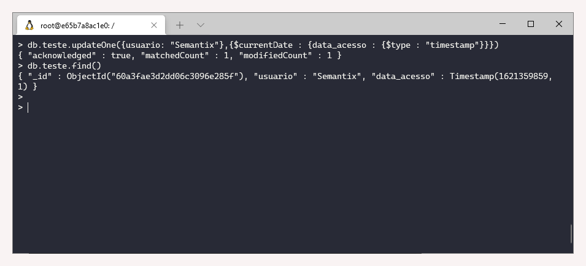
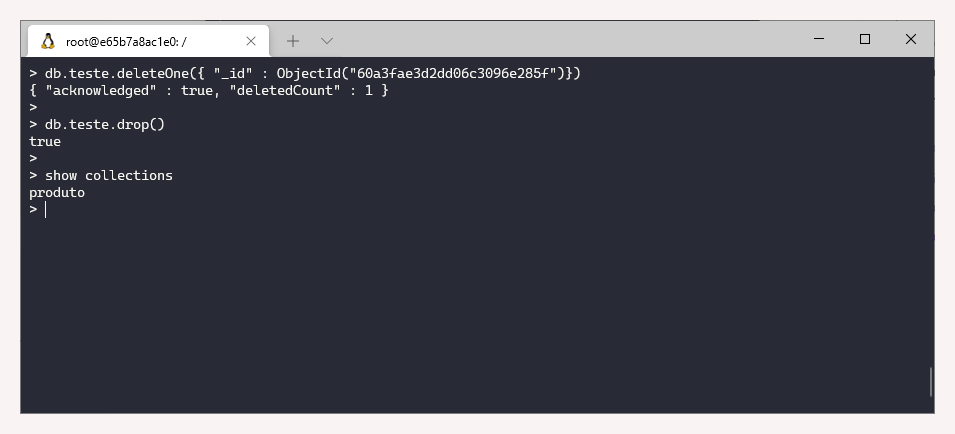

# 2.3 Mongo DB

### Revisão do conteúdo

Nessa aula aprendemos sobre formas de inserir, atualizar, pesquisar e deletar documentos, com apresentação dos principais comandos.


 Mais informações estão disponibilizadas na [documentação oficial](https://docs.mongodb.com/) e de forma mais objetiva na seção de [CRUD](https://docs.mongodb.com/manual/crud/).


### Exercício - **Atualização de Documentos**

Antes de iniciar os exercícios, é necessário ativar o cluster e acessar o Mongodb

`cd treinamentos`  
`cd mongodb`  
`docker-compose up -d`  
`docker exec -it mongo bash`  
`mongo`

Para referência, serão mostradas com imagens as atualizações realizadas em quatro atividades _\(números 1, 3, 7 e 10\)._

_Nota_: Nos exercícios resolvidos, a maior dificuldade _-_ dada a falta de prática - foi lembrar dos detalhes de escrita dos comandos como colocar " ", $  e {\[\( \)\]}.

**1. Mostrar todos os documentos da** _**collection**_ **produto do banco de dados seu nome**

A visualização dos documentos é realizada com os seguintes comandos:  
``  
****`use danielle   
db.produto.find()`

**2. Atualizar o valor do campo nome para “cpu i7” do id 1**

`db.produto.updateOne({_id : 1}, {$set: {nome: "cpu i7"}})`

**3. Atualizar o atributo quantidade para o tipo inteiro do id: 1**

`db.produto.updateOne({_id : 1}, {$set: {qtd: 15}})`

**4. Atualizar o valor do campo qtd para 30 de todos os documentos, com o campo qtd &gt;= 30**

`db.produto.updateMany({qtd : {$gte : 30}}, {$set : {qtd : 30}})`

**5. Atualizar o nome do campo “descricao.so” para “descricao.sistema” de todos os documentos**

`db.produto.updateMany({}, {$rename : { "descricao.so" : "descricao.sistema"}})`

**6. Atualizar o valor do campo descricao.conexao para “USB 2.0” de todos os documentos, com o campo descricao.conexão = “USB”**

`db.produto.updateMany({"descricao.conexao" : "USB"}, {$set : {"descricao.conexao" : "USB 2.0"}})`

**7. Atualizar o valor do campo descricao.conexao para “USB 3.0” de todos os documentos, com o campo descricao.conexao = “USB 2.0” e adicionar o campo “data\_modificacao”, com a data da atualização dos documentos**

`db.produto.updateMany({"descricao.conexao" : "USB 2.0"}, {$set : {"descricao.conexao" : "USB 3.0"}, $currentDate : {data_modificacao : {$type : "date"}}})`

**8. Atualizar um dos elementos do array descricao.sistema de “Windows” para “Windows 10” do id 3**

`db.produto.updateOne({_id : 3, "descricao.sistema" : "Windows"}, {$set : {"descricao.sistema.$" : "Windows 10"}})`

_Nota:_ Atenção ao uso do cifrão ao fim do campo descricao.sistema, caso contrário todo o _array_ será substituído por "Windows 10"

**9. Acrescentar o valor “Linux” no array descricao.sistema do id 4**

`db.produto.updateOne({_id : 4}, {$push : {"descricao.sistema" : "Linux"}})`

**10. Remover o valor “Mac” no array descricao.sistema do id 3 e adicionar o campo “ts\_modificacao”, com o timestamp da atualização dos documentos**

`db.produto.updateOne({_id : 3}, {$pull : {"descricao.sistema" : "Mac"}, $currentDate : {ts_modificacao : {$type : "timestamp"}}})`

### **Exercício - CRUD de Documentos**

**1. Criar a collection teste no banco de dados seu nome**

Para criar uma tabela \(_collection_\), utiliza-se os seguintes comandos:

`use danielle  
db.createCollection('teste')`

A mensagem `"ok" : 1`  equivale ao True, isto é, uma confirmação de que a tabela foi criada.

**2. Inserir o seguinte documento:**

* Campo: usuario, valor: Semantix
* Campo: data\_acesso, valor: data atual no formato ISODate

`db.teste.insertOne({usuario : "Semantix", data_acesso : new Date ()})`

**3. Buscar todos os documentos do ano &gt;= 2020**

`db.teste.find({data_acesso: {$gte : new Date ("2020")}})`

**4. Atualizar o campo “data\_acesso” para timestamp com o valor da atualização do usuario Semantix**

`db.teste.updateOne({usuario: "Semantix"},{$currentDate : {data_acesso : {$type : "timestamp"}}})`

**5. Buscar todos os documentos**

`db.teste.find()`

**6. Deletar o documento criado pelo id**

`db.teste.deleteOne({ "_id" : ObjectId("60a3fae3d2dd06c3096e285f")})`

**7. Deletar a** _**collection**_

`db.teste.drop()`

Conforme imagem, a única _collections_ que permanece após o `drop()`é a produto.

