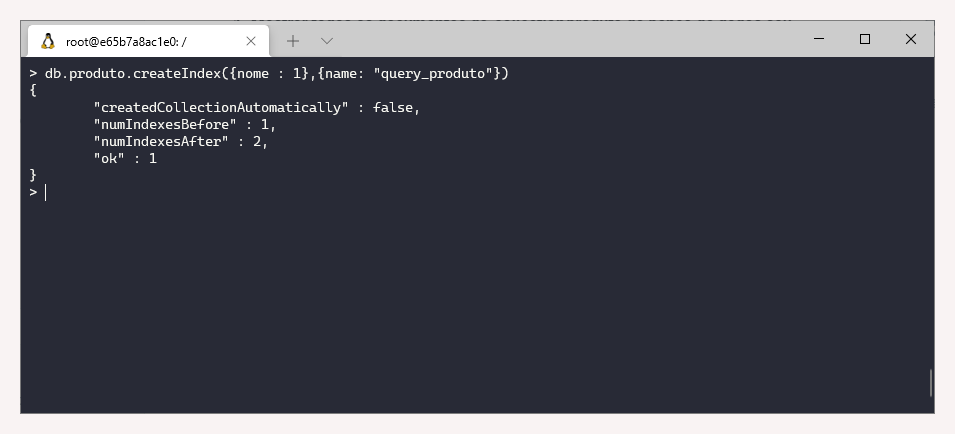

# 2.4 Mongo DB

### Revisão do conteúdo

Nessa aula foram apresentados os conceitos e criação de index, uso do regex para consultas e uso da interface gráfica \(Mongo Express e Mongo Compass\).


 Mais informações estão disponibilizadas na [documentação oficial](https://docs.mongodb.com/) e de forma mais objetiva nas seções [Index](https://docs.mongodb.com/manual/indexes/) e [Regex](https://docs.mongodb.com/manual/reference/operator/query/regex/).


### Exercício - **Index e plano de execução**

Antes de iniciar os exercícios, é necessário ativar o cluster e acessar o Mongodb

`cd treinamentos`  
`cd mongodb`  
`docker-compose up -d`  
`docker exec -it mongo bash`  
`mongo`

**1. Mostrar todos os documentos da** _**collection**_ **produto do banco de dados seu nome**

* Atividade já realizada nas aulas anteriores:

`use danielle   
db.produto.find()`

**2. Criar o index “query\_produto” para pesquisar o campo nome do produto em ordem alfabética**

`db.produto.createIndex({nome : 1},{name: "query_produto"})`

**3. Pesquisar todos os índices da** _**collection**_ **produto**

`db.produto.getIndexes({})`

**4. Pesquisar todos os documentos da** _**collection**_ **produto**

* Atividade já realizada nas aulas anteriores:

`db.produto.find()`

**5. Visualizar o plano de execução do exercício 4**

`db.produto.find().explain()`

**6. Pesquisar todos os documentos da collection produto, com uso da index “query\_produto”**

`db.produto.find().hint({nome : 1})`

**7. Visualizar o plano de execução do exercício 6.**

`db.produto.find().hint({nome : 1}).explain()`

**8. Remover o index “query\_produto”**

`db.produto.dropIndex({nome : 1})`

**9. Pesquisar todos os índices da** _**collection**_ **produto**

`db.produto.getIndexes({})`

### **Exercício - Consultas com Regex**

**1. Mostrar todos os documentos da collection produto do banco de dados seu nome**

* Atividade já realizada nas aulas anteriores:

`use danielle   
db.produto.find()`

**2. Buscar os documentos com o atributo nome,  que contenham a palavra “cpu”**

`db.produto.find ({nome : {$regex : "cpu"}})`

**3. Buscar os documentos  com o atributo nome, que começam por “hd” e apresentar os campos nome e qtd**

`db.produto.find ({nome : {$regex : /^hd/}}, {nome: 1, qtde :1})`

**4. Buscar os documentos  com o atributo descricao.armazenamento, que terminam com “GB” ou “gb” e apresentar os campos nome e descricao**

`db.produto.find ({"descricao.armazenamento" : {$regex : /gb/i}}, {nome: 1, descricao :1})`

**5. Buscar os documentos  com o atributo nome, que contenha a palavra memória, ignorando a letra “o”**

`db.produto.find ({nome : {$regex : /mem.ria/}})`

**6. Buscar os documentos  com o atributo qtd  que contenham valores com letras, ao invés de números.**

`db.produto.find ({qtde : {$regex : /[a-z]/}})`

_Nota_: Não retorna nenhum valor pois todos os campos qtd foram preenchidos com números.

**7. Buscar os documentos com o atributo descricao.sistema, que tenha exatamente a palavra “Windows”**

`db.produto.find ({"descricao.sistema" : {$regex : /^Windows$/}})`

_Nota_: Não retorna nenhum valor pois todos nos campos descricao.sistema não há a palavra exata Windows, e sim Window 10, Windows 8 - por exemplo. 

### **Exercício - CRUD através do Mongo Express**

Todas as questão devem ser realizadas através do Mongo Express

* Acesso: [http://localhost:8081/](http://localhost:8081/)

**1. Criar a** _**collection**_ **cliente no banco de dados seu nome**

Para criar uma _collection_, acessar o banco de dados \(danielle\), escrever em Collection Name cliente e clicar em _**create collections**_

**2. Inserir os seguintes documentos:**

* nome: Rodrigo, cidade: São José dos Campos, data\_cadastro: 10/08/2020
* nome: João, cidade: São Paulo, data\_cadastro: 05/08/2020

Visualização dos dados:

**3. Renomear a** _**collection**_ **para clientes**

Utilizar o Rename Collection: inserir o novo nome e clicar em **Rename.**

**4. Buscar os documentos da cidade de São Paulo**

A busca pode ser realizada utilizando a guia Simple ou Advanced. Em Simple, filtrar pela chave \(cidade\) e valor \(São Paulo\).

**5. Buscar os documentos da cidade de São Paulo e apresentar apenas o nome e a cidade**

A busca pode ser realizada utilizando a guia Advanced, pois será feita também uma projeção, isto é, serão selecionados apenas os dados necessários \(nome e cidade\).

**6. Atualizar o documento com nome João para cidade: Rio de Janeiro**

Para atualizar algum dado, clicar no documento, alterar as informações necessárias e salvar \(_Save_\).

**7. Criar um index para o campo cidade em ordem alfabética**

Selecionar a opção New Index, escrever `"cidade" : 1` e Salvar \(_Save_\).

**8. Deletar o documento com o nome João**

Para deletar o documento, clicar no ícone vermelho de lixeira ao lado do \_id. Uma janela de confirmação irá aparecer, selecionar o _Delete_.

**9. Deletar a** _**collection**_ **clientes**

Retornar ao banco de dados \(danielle\), clicar no ícone vermelho de lixeira do lado direito. Irá aparecer uma janela para confirmar a ação, sendo necessário digitar o nome da _collections_. Em seguida, selecionar o _Delete_.

### **Exercício - CRUD através do MongoDB Compass**

Todas as questão devem ser realizadas através do MongoDB Compass. O _download_ foi realizado em: [https://www.mongodb.com/try/download/compass](https://www.mongodb.com/try/download/compass)

Ao abrir o programa, clicar em **New Connections**. Selecionar a opção **Fill in connection fields individually**. A seguinte configuração será utilizada:

Hostname**:** localhost  
Port: 27017  
Authentication: None

Os exercícios realizados no MongoDB Compass seguiram as mesmas etapas do anterior, com intuito de familiarizar com o ambiente. 

