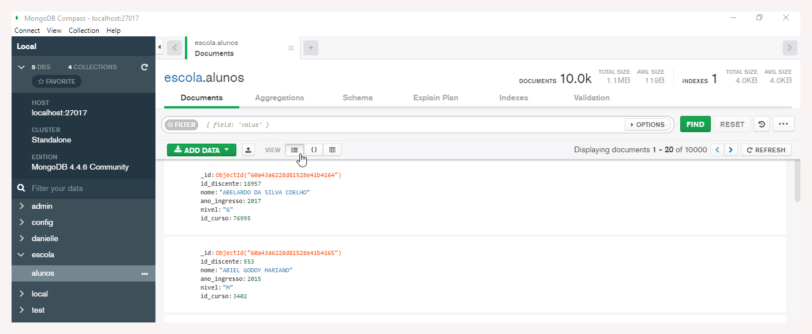
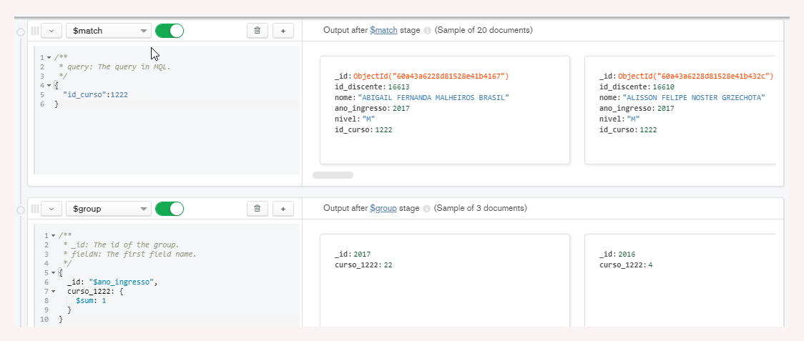
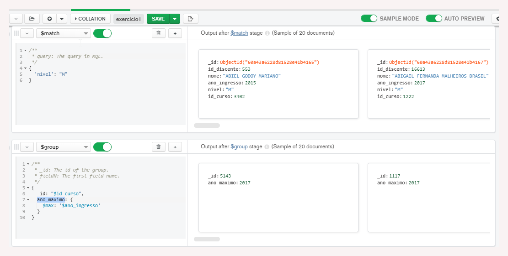
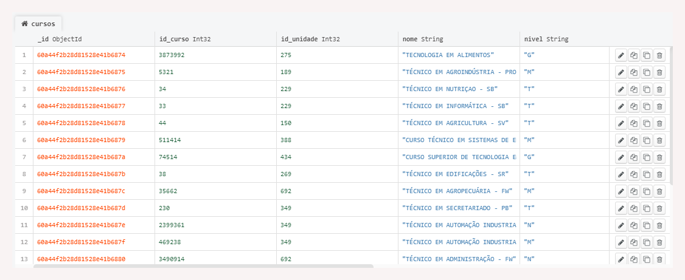
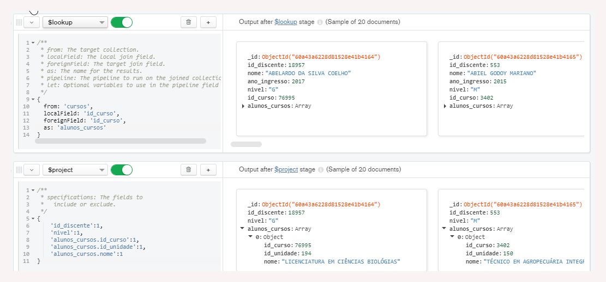

# 2.5 MongoDB

### Revisão do conteúdo

Foram apresentados os conceitos e uso de agregações. Também foram estudados aspectos sobre replicação de dados e MongoDB Cloud.


 Mais informações estão disponibilizadas na [documentação oficial](https://docs.mongodb.com/) e de forma mais objetiva nas seções [Aggregation](https://docs.mongodb.com/manual/aggregation/), [Lookup](https://docs.mongodb.com/manual/reference/operator/aggregation/lookup/), [Replication](https://docs.mongodb.com/manual/replication/)


### Exercício - **Agregações de Match, Group, Sort e Limit**

**1. Crie o banco de dados escola**

**2. Crie a collection alunos no banco de dados escola**

**3. Importe o arquivo “dataset/alunos.csv” para a collection alunos, com os seguintes atributos:**



* id\_discente: Number
* nome: String
* ano\_ingresso: Number
* nivel: String
* id\_curso: Number

**4. Visualizar os valores únicos do “nivel” de cada “ano\_ingresso”**

Selecionar a aba _Aggregations_ e a opção `$group`

`{_id: '$ano_ingresso', nivel_por_ano: { $addToSet: '$nivel'}}`

**5. Calcular a quantidade de alunos matriculados por cada “id\_curso”**

Na aba _Aggregations_, marcar a opção `$group`

`{_id: '$id_curso', qtde_por_curso: {$sum: 1}}`

**6. Calcular a quantidade de alunos matriculados por “ano\_ingresso” no "id\_curso“: 1222**

Na aba _Aggregations_, selecionar as opções `$group` e `$match`

Em match: `{'id_curso':1222}`

Em group: `{_id: '$ano_ingresso', curso_1222: {$sum: 1}}`

**7. Visualizar todos os documentos do “nível”: “M”**

Na aba _Aggregations,_ em match `{'nivel': 'M'}`

**8. Visualizar o último ano que teve cada curso \(id\_curso\) dos níveis “M”**

Na aba _Aggregations_, selecionar as opções `$group` e `$match`

Em match: `{'nivel': 'M'}`

Em group: `{_id: '$id_curso', ano_maximo: { $max: '$ano_ingresso'}}`

**9. Visualizar o último ano que teve cada curso \(id\_curso\) dos níveis “M”, ordenados pelos anos mais novos de cada curso**

Na aba _Aggregations_, selecionar `$group,  $match e $sort` e adicionar os seguintes comandos:

Em match: `{'nivel': 'M'}`

Em group: `{_id: '$id_curso', ano_maximo: { $max: '$ano_ingresso'}}`

Em sort: `{ 'ano_maximo':` **-**`1 }`

**10. Visualizar o último ano que teve os 5 últimos cursos \(id\_curso\) dos níveis “M”, ordenados pelos anos mais novos**

Na aba _Aggregations_, selecionar `$group,  $match, $sort e $limit.` Adicionar os seguintes comandos:

Em match: `{'nivel': 'M'}`

Em group: `{_id: '$id_curso', ano_maximo: { $max: '$ano_ingresso'}}`

Em sort: `{'ano_maximo':` **-**`1 }`

Em limit: `5`

_Para referência visual, nas imagens a seguir o print da tela do MongoDB Compass_:

### **Exercício - Agregação com Lookup e project**

**1. Crie a collection cursos no banco de dados escola**

**2. Importe o arquivo “dataset\cursos.csv” para a collection cursos, com os seguintes atributos:**



* id\_curso: Number
* id\_unidade: Number
* nome: String
* nivel: String

**3. Realizar o left outer join da collection alunos e cursos, quando o id\_curso dos 2 forem o mesmo.**

Selecionar a aba _Aggregations_ e a opção `$group` 

`{from: 'cursos', localField: 'id_curso', foreignField: 'id_curso', as: 'alunos_cursos'}`

**4. Realizar o left outer join da collection alunos e cursos, quando o id\_curso dos 2 forem o mesmo e visualizar apenas os seguintes campos**

* Alunos: id\_discente, nivel
* Cursos: id\_curso, id\_unidade, nome

Na aba _Aggregations_, selecionar as opções `$group` e `$project`

Em group:`{from: 'cursos', localField: 'id_curso', foreignField: 'id_curso', as: 'alunos_cursos'}`

Em project: `{'id_discente':1, 'nivel':1, 'alunos_cursos.id_curso':1, 'alunos_cursos.id_unidade':1, 'alunos_cursos.nome':1}`

### **Exercício - MongoDB Atlas**

_Nessa aula/exercício foram detalhados todas as etapas de configuração do MongoDB Atlas. Não serão apresentadas imagens dessas etapas pois consistem de inúmeros pequenos passos, que ficam melhor explicados e compreendidos por vídeo._

**1. Criar a conexão do cluster MongoDB Atlas através do MongoDB Compass**

**2.  Criar o banco de dados escola no cluster em Cloud**

**3. Importe o arquivo “dataset\cursos.csv” para a collection cursos e o arquivo “dataset\alunos.csv” para a collection alunos.**

**4. Fazer consultas de teste.**

