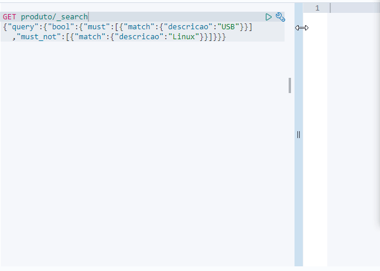

# 5.4 Elastic

### Revisão do conteúdo

Nesta quarta aula de Elastic foram apresentados os conceitos de _queries_ e filtros; índice remissivo e índice invertido; consulta booleana; fatores que afetam a ordem de busca e consultas por intervalos numéricos e de tempo.


 Mais informações estão disponibilizadas na [documentação oficial](https://www.elastic.co/guide/index.html). Conteúdo específico sobre Query DSL está disponibilizada [aqui](https://www.elastic.co/guide/en/elasticsearch/reference/current/query-dsl.html).


### **Exercício - Query e Filtros**

Realizar todas as buscas a seguir no índice produto.  
Antes de iniciar os exercícios, é necessário ativar o cluster e acessar o Elastic

`cd treinamentos  
cd elastic  
sudo sysctl -w vm.max_map_count=262144  
docker-compose up -d  
http://localhost:5601`

* Nota: apesar do `grep vm.max_map_count /etc/sysctl.conf` já constar a configuração de `vm.max_map_count=262144`, foi necessário utilizar o comando `sudo sysctl -w vm.max_map_count=262144` para que o container \(elastic elastic search 1\) permanecesse ativo.

Para as pesquisas, executar os comandos conforme cada solicitação

**1. Buscar no termo nome o valor mouse**

`GET produto/_search   
{   
   "query": {  
      "term": {   
         "nome": "mouse"   
      }   
   }  
}`

**2. Buscar no termo nome os valores mouse e teclado**

`GET produto/_search   
{   
   "query": {  
      "terms": {   
         "nome": ["mouse", "teclado"]   
      }   
   }  
}`

**3. Realizar a mesma busca do item 1 e 2, desconsiderando o score**

Para desconsiderar o score, utiliza o constant\_score. No exemplo abaixo está a resolução do item 1

`GET produto/_search`   
****`{   
   "query": {   
      "constant_score": {   
         "filter": {   
            "term": {   
               "nome": "mouse"   
             }   
         }   
      }   
   }   
}`

A seguir é apresentada a resolução do item 2, mas sem considerar a indentação\*.

`GET produto/_search   
{"query":{"constant_score":{"filter":{"terms":{"nome":["mouse","teclado"]}}}}}`

* Nota: Os comandos serão apresentados sem a indentação para facilitar a anotação. A transformação para o outro formato pode ser realizada diretamente na ferramenta Dev Tools, conforme mostrado a seguir: 

**4. Buscar os documentos que contenham a palavra “USB” no atributo descrição**

`GET produto/_search   
{"query":{"match":{"descricao":"USB"}}}`

**5. Buscar os documentos que contenham a palavra “USB” e não contenham a palavra “Linux” no atributo descrição**

`GET produto/_search  
{"query":{"bool":{"must":[{"match":{"descricao":"USB"}}],"must_not":[{"match":{"descricao":"Linux"}}]}}}`

**6. Buscar os documentos que podem ter a palavra “memória” no atributo nome ou contenham a palavra “USB” e não contenham a palavra “Linux” no atributo descrição**

`GET produto/_search   
{"query":{"bool":{"should":[{"match":{"nome":"memória"}},{"match":{"descricao":"USB"}}],"must_not":[{"match":{"descricao":"Linux"}}]}}}`

### Exercício -Ordem de Busca

Realizar todas as buscas a seguir no índice produto.

* Nota: O operador padrão é o OU \(_or_\)

**1. Buscar os documentos que contenham as palavras “Windows” e “Linux” no atributo descrição**

`GET produto/_search  
{"query":{"match":{"descricao":{"query":"Windows Linux", "operator":"and"}}}}`

**2. Buscar os documentos que contenham as palavras “Windows”, “Linux” ou “USB” no atributo descrição**

`GET produto/_search  
{"query":{"match":{"descricao":"Windows Linux USB"}}}`

**3. Buscar os documentos que contenham pelo menos 2 palavras da seguinte lista de palavras: “Windows”; “Linux” e “USB” no atributo descrição**

`GET produto/_search  
{"query":{"match":{"descricao":{"query":"Windows Linux USB","minimum_should_match":2}}}}`

**4. Buscar os documentos que contenham pelo menos 50% da seguinte lista de palavras: “Windows”; “Linux” e “USB” no atributo descrição**

`GET produto/_search  
{"query":{"match":{"descricao":{"query":"Windows Linux USB","minimum_should_match":"50%"}}}}`

### **Exercício - Consultas por Intervalo**

**1. Verificar se existe o índice populacao**

Para essa verificação, usar o comando`HEAD populacao`

* Nota: Esse índice foi criado anteriormente, na aula [5.2 Elastic](5.2-elastic.md)

**2. Executar as consultas no índice populacao**

a\) Mostrar os documentos com o atributo "Total Population" menor que 100

`GET populacao/_search   
{"query":{"range":{"Total Population":{"lt":100}}}}`

b\) Mostrar os documentos com o atributo "Median Age" maior que 70

`GET populacao/_search   
{"query":{"range":{"Median Age":{"gt":70}}}}`

c\) Mostrar os documentos 50 \(Zip Code: 90056\) à 60 \(Zip Code: 90067\) do índice de populacao

`GET populacao/_search   
{"query":{"range":{"Zip Code":{"gte":90056,"lte":90067}}}}`

**3. Importar através do Kibana o arquivo weekly\_MSFT.csv com o índice bolsa**



* Acessar [http://localhost:5601/app/ml\#/datavisualizer](http://localhost:5601/app/ml#/datavisualizer) e realizar upload do arquivo.
* Renomear o _index name_ para bolsa
* Clicar em _Import_
* Verificar se o índice está disponível para consulta -com o comando`HEAD bolsa`
* De forma complementar, verificar as configurações e mapeamento, utilizando os comandos abaixo:

`GET bolsa/_settings  
GET bolsa/_mapping`

**4. Executar as consultas no índice bolsa**

a\) Visualizar os documentos do dia 2019-01-01 à 2019-03-01. \(hits = 9\)

`GET bolsa/_search   
{"query":{"range":{"timestamp":{"gte":"2019-01-01","lte":"2019-03-01"}}}}`

b\) Visualizar os documentos do dia 2019-04-01 até agora. \(hits = 3\)

`GET bolsa/_search   
{"query":{"range":{"timestamp":{"gte":"2019-04-01","lte":"now"}}}}`

