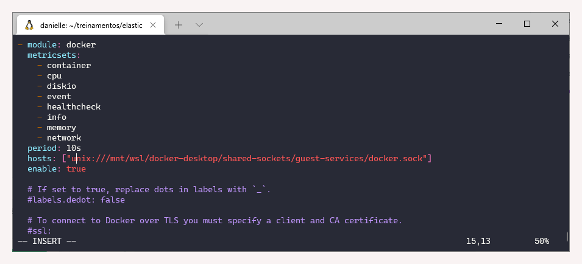

# 5.6 Elastic

### Revisão do conteúdo

A sexta aula sobre Elastic discorreu sobre ingestão de dados com _beats,_ mostrando os conceitos, instalação, configuração e execução de Filebeats, Metricbeats e Heartbeats.


 Mais informações estão disponibilizadas na [documentação oficial](https://www.elastic.co/guide/en/beats/libbeat/current/index.html). 


### **Instalação - Filebeats**



```text
# Download
curl -L -O https://artifacts.elastic.co/downloads/beats/filebeat/filebeat-7.9.2-linux-x86_64.tar.gz

# Descompactação
tar xzvf filebeat-7.9.2-linux-x86_64.tar.gz
```

### **Instalação - Metricbeats**



```text
# Download
curl -L -O https://artifacts.elastic.co/downloads/beats/metricbeat/metricbeat-7.9.2-linux-x86_64.tar.gz

# Descompactação
tar xzvf metricbeat-7.9.2-linux-x86_64.tar.gz
```

### **Instalação -** Heart**beats**



```text
# Download
curl -L -O https://artifacts.elastic.co/downloads/beats/heartbeat/heartbeat-7.9.2-linux-x86_64.tar.gz

# Descompactação
tar xzvf heartbeat-7.9.2-linux-x86_64.tar.gz
```

### **Exercício - Beats**

Antes de iniciar os exercícios, é necessário ativar o cluster e acessar o Elastic

`cd treinamentos  
cd elastic  
sudo sysctl -w vm.max_map_count=262144  
docker-compose up -d`

* Nota: apesar do `grep vm.max_map_count /etc/sysctl.conf` já constar a configuração de `vm.max_map_count=262144`, foi necessário utilizar o comando `sudo sysctl -w vm.max_map_count=262144` para que o container \(elastic elastic search 1\) permanecesse ativo.

**1. Enviar o arquivo Paris com uso do Filebeat**



Inicialmente foi criada a pasta _dataset,_ contendo os arquivos de log \(Paris\), no diretório Elastic. Em seguida, foi realizada a instalação do Filebeats conforme referência e comandos mostrados no tópico anterior.

Por fim, foi necessário editar o arquivo yml com o comando:  
`vi ./filebeat-7.9.2-linux-x86_64/filebeat.yml`

_i_ \# para editar

Alterar as seguintes informações:

> enabled: true  
> paths: - /home/danielle/treinamentos/elastic/dataset/paris-925.logs

_Esc_ \# para sair  
_:wq_ \# para salvar


Em seguida, é necessário verificar o arquivo yml. Caso apresente algum erro é melhor apagar e refazer, pois pode ter sido algo bem sutil, como um espaçamento, quebra de linha ou dois pontos que foram configurados errados.

`cd ./filebeat-7.9.2-linux-x86_64/  
./filebeat test config`

Tem que aparecer a mensagem de Config OK. Em seguida, testar a conexão:  
`./filebeat test output`


E por fim, configurar como _root_ e enviar as informações:

`sudo chown root filebeat.yml  
sudo ./filebeat -e`

**2. Verificar a quantidade de documentos do índice criado pelo Filebeat e visualizar seus 10 primeiros documentos**

No console do [Dev Tools](http://localhost:5601/app/dev_tools#/console), verificar se foi criado um índice pelo Filebeat. Notar que   o nome foi dado automaticamente, referenciando a data de criação.

`HEAD filebeat-7.9.2-2021.06.20-000001` 

Para verificar a quantidade de documentos e visualizar os 10 primeiros, usar os seguintes comandos:

`GET filebeat-7.9.2-2021.06.20-000001/_count  
GET filebeat-7.9.2-2021.06.20-000001/_search`

**3. Monitorar as métricas do docker**

A instalação do Metricbeats foi realizada conforme referência e comandos mostrados no tópico anterior. Em seguida, acessar o diretório do MetricBeat, habilitar o módulo docker e verificar se as configurações estão corretas, utilizando os seguintes comandos:

`cd metricbeat-7.9.2-linux-x86_64/  
./metricbeat modules enable docker  
./metricbeat test config  
./metricbeat test output`


Para configurar o módulo do docker, acessar `cd modules.d` e encontrar o socket do Docker**:** `sudo find / -name docker.sock`

O nome do caminho deverá ser atualizado no aqruivo .yml para:`/mnt/wsl/docker-desktop/shared-sockets/guest-services/docker.sock`

\(lembrando que para retornar ao diretório utiliza o Control+C\)

Agora é necessário editar o arquivo yml com o comando:

`vi docker.yml`

_i_ \# para editar

Alterar as seguintes informações:

> Remover os \# das métricas desejadas  
> Atualizar caminho do hosts: -`["unix:///mnt/wsl/docker-desktop/shared-sockets/guest-services/docker.sock"]  
> Incluir enable: true`

_Esc_ \# para sair  
_:wq_ \# para salvar



Para inicializar o metricbeat:

`sudo chown root metricbeat.yml   
sudo chown root modules.d/system.yml  
sudo chown root modules.d/docker.yml    
sudo ./metricbeat -e`


**4. Verificar a quantidade de documentos do índice criado pelo Metricbeat e visualizar seus 10 primeiros documentos**

No console do [Dev Tools](http://localhost:5601/app/dev_tools#/console), verificar se foi criado um índice pelo Metricbeat. Semelhante ao filebeat, o nome foi dado automaticamente, referenciando a data de criação.

`HEAD metricbeat-7.9.2-2021.06.20-000001` 

Para verificar a quantidade de documentos e visualizar os 10 primeiros, usar os seguintes comandos:

`GET metricbeat-7.9.2-2021.06.20-000001/_count  
GET metricbeat-7.9.2-2021.06.20-000001/_search`

**5. Monitorar o site** [**https://www.elastic.co/pt/** ](https://www.elastic.co/pt/)**com uso do Heartbeat**

Para instalar Heartbeats, seguir os passos conforme referência e comandos mostrados no tópico anterior. Acessar o diretório e editar o arquivo yml:

`cd heartbeat-7.9.2-linux-x86_64/  
vi heartbeat.yml`

_i_ \# para editar

> Alterar a url: \["http://www.elastic.co/pt/"\]

_Esc_ \# para sair  
_:wq_ \# para salvar


Em seguida,  verificar se as configurações estão corretas, utilizando os seguintes comandos:

`./heartbeat test config  
./heartbeat test output`

Para inicializar o heartbeat:

`sudo chown root heartbeat.yml   
sudo ./heartbeat -e`


**6. Verificar a quantidade de documentos do índice criado pelo Heartbeat e visualizar seus 10 primeiros documentos**

No console do [Dev Tools](http://localhost:5601/app/dev_tools#/console), verificar se foi criado um índice pelo Metricbeat. Semelhante ao filebeat e metricbeat, o nome foi gerado automaticamente, referenciando a data de criação.

`HEAD heartbeat-7.9.2-2021.06.20-000001`

Para verificar a quantidade de documentos e visualizar os 10 primeiros, usar os seguintes comandos:

`GET heartbeat-7.9.2-2021.06.20-000001/_count  
GET heartbeat-7.9.2-2021.06.20-000001/_search`

