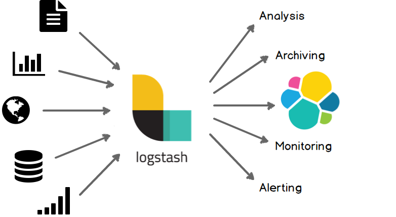

# 5.7 Elastic

### Revisão do conteúdo

Na sétima aula sobre Elastic foram apresentados os conceitos e configurações de Logstash; plugins de entrada \(_input_\); plugins de saída \(_output_\) e plugins de filtro \(_filter_\).


 Mais informações estão disponibilizadas na [documentação oficial](https://www.elastic.co/guide/en/beats/libbeat/current/index.html). Conteúdo específico sobre Logstash pode ser acessado [nesse link](https://www.elastic.co/pt/logstash).


"_O Logstash é um pipeline de processamento de dados do lado do servidor que faz a ingestão de dados a partir de inúmeras fontes simultaneamente, transforma-os e envia-os para o Elasticsearch_". [Referência](https://www.elastic.co/pt/what-is/elk-stack) 

### Exercício

**1. Enviar o arquivo Paris-925  para o Logstash, com uso do Filebeat.**

* Nota: O arquivo foi disponibilizado na aula [5.6 Elastic](5.6-elastic.md)
* Para realização dos exercícios 1e 2 foi recomendado não ativar o cluster. Dentro do diretório do filebeat acessar o arquivo yml para edição.

`cd filebeat-7.9.2-linux-x86_64/  
sudo vi filebeat.yml`

* OBS: Por algum motivo o arquivo filebeat.yml \(1 KB\) estava em branco e havia um outro arquivo denominado filebeat.yml~ \(9 KB\). Renomeei ambos, de modo que este último ficasse com o nome coreto. Dessa forma consegui acessar o vi e editar o arquivo.

Em outputs realizar a seguinte alteração:

_i_ \# para editar

> Desabilitar o Elasticsearch, inserindo \# antes do texto  
> Habilitar o Logstash, removendo a \# antes do texto

_Esc_ \# para sair  
_:wq_ \# para salvar

**2. Configurar e executar o logstash com as seguintes configurações**

* Entrada: beats {port =&gt; 5044}
* Saída: elasticsearch {hosts =&gt; \[ “elasticsearch:9200" \], index =&gt; “danielle-%{+YYYY.MM.dd}" }

No diretório do elastic, alterar o arquivo conf do Logstash

`sudo vi pipeline/logstash.conf`

Ao tentar ativar o cluster com docker-compose up-d irá aparecer uma mensagem de erro. Isso ocorre pois um arquivo de inicialização foi editado. Para solucionar, dar um "down" e depois um "up" novamente.

**3. Verificar a quantidade de documentos do índice criado pelo Logstash e visualizar seus 10 primeiros documentos**

O primeiro passo é inicializar os beats, que não foram configurados para iniciar automaticamente e verificar se está configurado corretamente:

`cd filebeat-7.9.2-linux-x86_64/  
sudo ./filebeat test config  
sudo ./filebeat test output`

Como o arquivo foi enviado anteriormente por outra saída, é necessário deletar a pasta data e logs para conseguir realizar essa operação pelo logstash. Em seguida, inicializar o filebeat

`sudo rm -rf data/   
sudo rm -rf logs  
sudo ./filebeat -e`

No console do [Dev Tools](http://localhost:5601/app/dev_tools#/console), verificar se foi criado um índice pelo Filebeat. Notar que   o nome foi dado conforme configurado.

`HEAD danielle-2021.06.20`

Para verificar a quantidade de documentos e visualizar os 10 primeiros, usar os seguintes comandos:

`GET danielle-2021.06.20/_count  
GET danielle-2021.06.20/_search`

